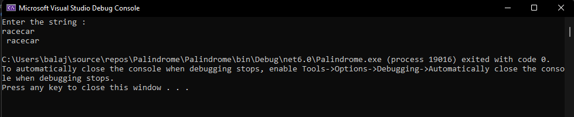
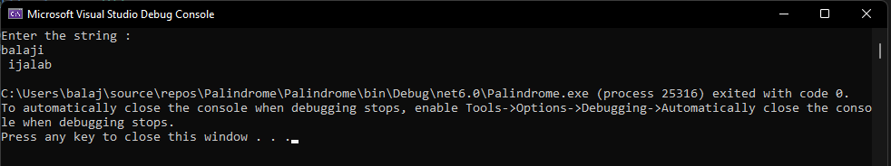

# Palindrome


## Aim:
To write a C# program to find whether the given string is a Palindrome or not.
## Algorithm:
### Step 1:
Develop a C# program using a class.
### Step 2:
Initialize two strings in which one is input string and another one is empty string.
### Step 3:
Using for loop reverse the characters from the input string and store it in the empty string.
### Step 4:
Print the string and check whether it is palindrome or not.
## Program:
```
#PROGRAM DEVELOPED BY : K.BALAJI
#REGISTER NUMBER : 212221230011
```
```
using System;
namespace palindrome
{
    public class condition
    {
    public static void Main(string[] args)
        {
            string str;
            string str1=" ";
            Console.WriteLine("Enter the string :");
            str = Console.ReadLine();
            int i;
            for(i=str.Length-1;i>=0;i--)
            {
                str1 += str[i];
            }
            if(str1 == str)
            {
                Console.WriteLine(str1);
            }
            else
            {
                Console.WriteLine(str1);
            }
        }
    }
}

```
## Output:
### Case 1:

### Case 2:


## Result:
Thus the C# program to display whether the given string is Palindrome or not is executed successfully.
